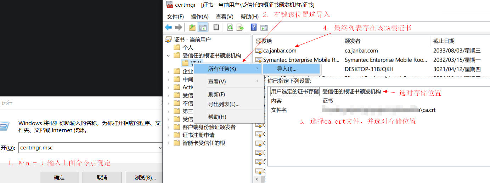

## UpDownFile
简易上传下载文件服务器，针对场景为临时需要上传或下载单个文件，完成后直接关闭服务器就完事了。

安装: `go install github.com/jan-bar/UpDownFile@latest`,或者: [releases](https://github.com/jan-bar/UpDownFile/releases)

1. 可以使用url访问，会显示一个简易web页面，可以在这个web页面**上传下载**文件，以及进行文件的排序。  
2. 也可以使用wget或curl命令行工具上传下载文件，多种选择，总有一个是你想要的方式。  
3. 支持https方式启动服务器和客户端，传输内容加密，数据更安全  
4. 本工具作为客户端时可以实现断点上传或断点下载。提示里面有服务器和客户端命令行，可以参考。  
5. wget用`-c`,curl用`-C -`可以实现断点下载,可使用`curl -C - -T`实现断点上传。我的cli命令行使用`-c`可以支持断点**上传**和**下载**。  
6. 可以执行`.\UpDownFile -reg -s 127.0.0.1:8080`在同级目录下产生`addRightClickRegistry.reg`的注册表文件,双击reg文件添加右键菜单。  


7. web页面展示如下图所示,支持断点下载,支持web直接上传：


执行：`upDownFile -h`，可查看服务端帮助信息，配置文件示例 [server.yaml](https://github.com/jan-bar/UpDownFile/blob/master/server.yaml)
```shell
Usage of UpDownFile:
  -c string
        config file (default "server.yaml")
  -p string
        path
  -reg
        add right click registry
  -s string
        ip:port
```

执行：`upDownFile cli -h`，可查看客户端帮助信息：
```shell
Usage of UpDownFile cli:
  -auth string
        username:password
  -c    resumed transfer offset
  -ca string
        ca.crt to verify peer against
  -d string
        <raw string> or @tmp.txt
  -g    gzip file to send
  -k    allow insecure server connections
  -o string
        output
  -t duration
        client timeout (default 1m0s)
```

执行：`UpDownFile`会打印辅助信息，里面有使用curl和wget的上传下载文件命令。  
```bash
upDownFile -c server.yaml -s :443 -p /webroot

web service: https://127.0.0.1:443

server:
    upDownFile -s [::]:443 -p /webroot
registry:
    upDownFile -s [::]:443 -reg
cli get:
    upDownFile cli -c -auth "user:pass" -ca ca.crt -o C:\example.txt "https://janbar.com/example.txt"
cli post:
    upDownFile cli -c -auth "user:pass" -ca ca.crt -d @C:\example.txt "https://janbar.com/example.txt"

Get File:
    wget --user "user" --password "pass" --ca-certificate ca.crt -c --content-disposition "https://janbar.com/example.txt"
    curl -u "user:pass" --cacert ca.crt -C - -OJ "https://janbar.com/example.txt"

Post File:
    wget --user "user" --password "pass" --ca-certificate ca.crt -qO - --post-file=C:\example.txt "https://janbar.com/example.txt"
    curl -u "user:pass" --cacert ca.crt --data-binary @C:\example.txt "https://janbar.com/example.txt"
    curl -u "user:pass" --cacert ca.crt -F "file=@C:\example.txt" "https://janbar.com/example.txt/"

Get Offset:
    curl -u "user:pass" --cacert ca.crt -H "Content-Type:application/offset" "https://janbar.com/example.txt"
    wget --user "user" --password "pass" --ca-certificate ca.crt -qO - --header "Content-Type:application/offset" "https://janbar.com/example.txt"

Put File:
    curl -u "user:pass" --cacert ca.crt -C - -T C:\example.txt "https://janbar.com/example.txt"
```

不用改host的测试命令: `curl --resolve "janbar.com:443:127.0.0.1" --resolve "janbar.com:80:127.0.0.1" https://janbar.com`

## 使用详解
正常的上传下载没啥可说的,可以通过web页面也可以通过curl或wget命令。  
但是断点上传的功能我只找到了curl命令支持,不过需要指定上传断点位置。  
因此可以使用如下命令得到curl断点上传命令,直接执行返回的命令就可以断点上传：  
```shell
# 获取服务器文件偏移
curl -H "Content-Type:application/offset" http://127.0.0.1:8080/tmp.txt
# 返回断点上传命令
curl -C 9662 -T file http://127.0.0.1:8080/tmp.txt

# 获取服务器文件偏移
wget -qO - --header "Content-Type:application/offset" http://127.0.0.1:8080/tmp.txt
# 返回断点上传命令
curl -C 9662 -T file http://127.0.0.1:8080/tmp.txt

# 全新上传文件
curl -C - -T tmp.txt http://127.0.0.1:8080/tmp.txt
# 从文件某个偏移上传到服务器
curl -C 9662 -T file http://127.0.0.1:8080/tmp.txt
```

cli支持断点上传,只需带上`-c`参数即可,内部实现自动获取断点位置,一步到位：
```shell
UpDownFile cli -c -d @tmp.txt http://127.0.0.1:8080/tmp.txt
```
断点下载`curl`,`wget`,以及我的cli工具均支持,没啥好说的,都在示例里面。

## 生成https证书
```shell
# 安装工具
go install github.com/jan-bar/mkcert@latest
# 安装CA证书
mkcert -install
# 生成指定域名和ip的证书,得到2个文件: janbar.com+4.pem,janbar.com+4-key.pem
mkcert janbar.com "*.janbar.com" localhost 127.0.0.1 ::1
# 查看CA证书路径,根据不同系统添加CA根证书信任
mkcert -CAROOT
```

windows电脑按图所示添加`CA`根证书  
在host中添加`127.0.0.1 janbar.com`之后浏览器访问`https://janbar.com`服务器就不会提示不安全  


## 使用gzip上传下载
使用`UpDownFile cli -g`启用gzip传输,减少传输时间,未知传输数据大小因此进度会不准  
上传时,客户端压缩gzip文件后上传压缩数据,服务器会自动解压gzip文件  
下载时,服务器压缩gzip文件后下载压缩数据,客户端会自动解压gzip文件  
注意: 使用gzip上传下载时,断点续传失效  

## 总结
该工具是我为了临时启用一个http服务器,客户端用`curl`,`wget`这类常见工具就能完成文件上传下载功能  
方便传输文件,客户端也可以是浏览器,满足各种使用场景
