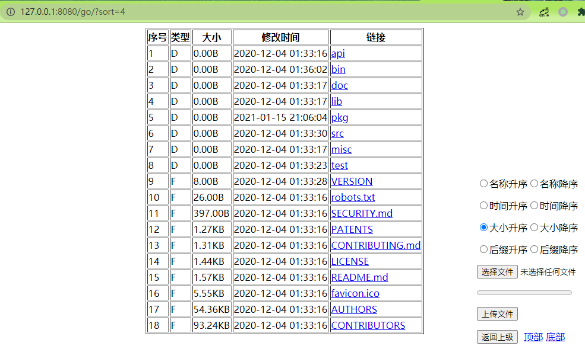

# UpDownFile
简易上传下载文件服务器，针对场景为临时需要上传或下载单个文件，完成后直接关闭服务器就完事了。

1. 可以使用url访问，会显示一个简易web页面，可以在这个web页面**上传下载**文件，以及进行文件的排序。  
2. 也可以使用wget或curl命令行工具上传下载文件，多种选择，总有一个是你想要的方式。  
3. 增加秘钥选项，使用后上传下载传输的数据全都加密，且秘钥每次都随机，有crc和时间戳校验，安全性极高。  
4. 使用加密选项时，无法通过web展示目录页面（前端加密代码不想写），可通过本程序命令行实现加密上传下载。  
5. 本工具作为客户端时可以实现断点上传或断点下载。提示里面有服务器和客户端命令行，可以参考。  
6. 成功执行后会显示帮助命令，可以复制改改就能用，非常方便。  
7. wget用`-c`,curl用`-C -`可以实现断点下载,没有找到断点上传。我的cli命令行使用`-c`可以支持断点上传和下载。  
8. 可以执行`.\UpDownFile.exe -reg -s 127.0.0.1:8080`在同级目录下产生`addRightClickRegistry.reg`的注册表文件,双击reg文件添加右键菜单。  


9. web页面展示如下图所示：



10. 确保文件正确性,增加计算md5值功能,服务器端会自动计算md5值,使用cli工具时客户端也会计算md5值,包括加密传输时也会正确计算md5值。
```bash
GET >e:\1.txt 100% 9d684b1f28fbde1b730681673d83530e
GET >e:\2.jpg 100% f7d3bb804a1fbb12b8eff77785a1bc4c
POST>e:\dos2unix 100% 3a7237e306544a12b5d0438fadc55f03
```

执行：UpDownFile，会打印帮助文档，里面有使用curl和wget的上传下载文件命令。  
下载文件时会自动保存文件名为参数里面的basename。  
上传文件时会保存到url参数里面的文件路径。  
```bash
UpDownFile.exe -s 127.0.0.1:8080 -p C:\dir -e password
dir [C:\dir],url [http://127.0.0.1:8080/]

server:
    UpDownFile.exe -s 127.0.0.1:8080 -p C:\dir -e password
cli get:
    UpDownFile.exe cli -u "http://127.0.0.1:8080/tmp.txt" -c -e password
cli post:
    UpDownFile.exe cli -d @C:\tmp.txt -u "http://127.0.0.1:8080/tmp.txt" -c -e password

GET file:
    wget -c --content-disposition "http://127.0.0.1:8080/tmp.txt"
    curl -C - -OJ "http://127.0.0.1:8080/tmp.txt"
POST file:
    wget -qO - --post-file=C:\tmp.txt "http://127.0.0.1:8080/tmp.txt"
    curl --data-binary @C:\tmp.txt "http://127.0.0.1:8080/tmp.txt"
    curl -F "file=@C:\tmp.txt" "http://127.0.0.1:8080/"
```
